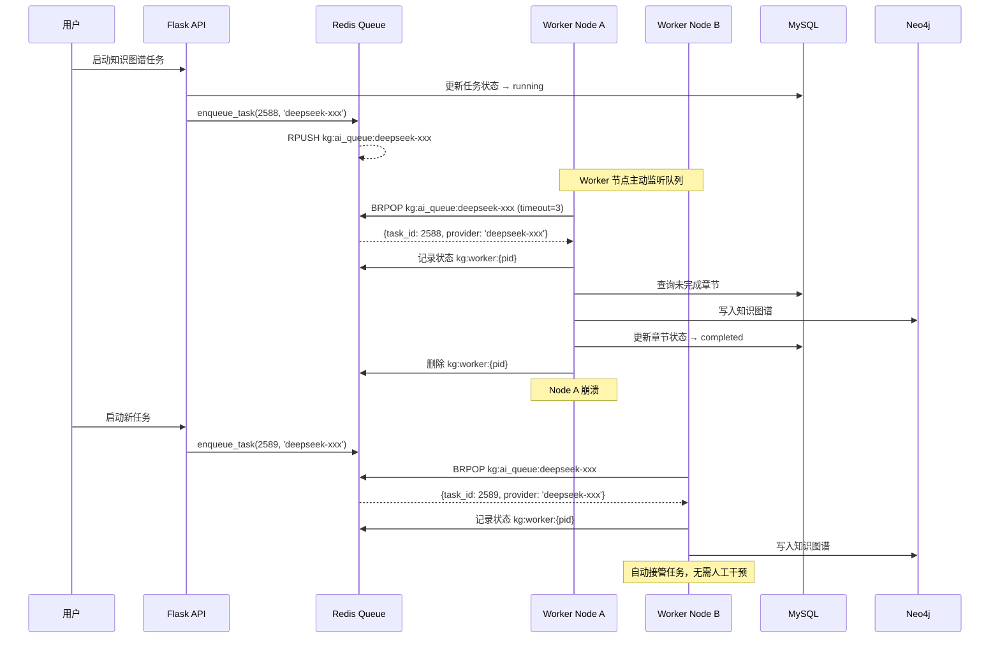

# Worker 节点任务分配与故障恢复机制

## 问题回答

### Q1: 启动节点后会立即分配 Worker 和任务吗？

**简短回答**: **不会立即分配任务，而是 Worker 主动从队列获取任务。**

#### 详细说明:

**启动流程**:

1. **启动 Worker 节点**:
   ```bash
   python worker.py
   ```

2. **Worker 进程启动**:
   - 创建多个子进程（每个 Provider 2个进程，默认配置）
   - 每个进程进入循环，**主动监听队列**

3. **任务获取机制** (关键):
   ```python
   # 代码位置: kg_task_worker.py Line 90
   item = brpop_task(provider, timeout=3)
   ```

   - 使用 Redis `BRPOP` 命令（**阻塞式弹出**）
   - timeout=3 秒，如果队列为空则等待 3 秒
   - **队列有任务时立即获取，队列为空则等待**

**分配时机**:

| 场景 | 行为 | 说明 |
|-----|------|------|
| **队列已有任务** | ✅ **立即分配** | Worker 启动后立即从队列获取任务 |
| **队列为空** | ⏸️ **等待状态** | Worker 进程阻塞等待，每 3 秒轮询一次 |
| **新任务入队** | ✅ **实时分配** | Redis BRPOP 立即返回，Worker 获取任务 |

**关键特性**:
- ✅ **去中心化**: 没有中央调度器，Worker 自主获取
- ✅ **实时响应**: 新任务入队后，空闲 Worker 立即获取（最多 3 秒延迟）
- ✅ **负载均衡**: 多个 Worker 竞争同一队列，先到先得

---

### Q2: 停止节点后，分配的 Worker 和任务怎么处理？

**简短回答**: **任务会丢失，但设计了多层保护机制来最小化影响。**

#### 场景分析:

##### 场景 1: 正在处理的任务（Worker 正在执行）

**会发生什么**:
1. Worker 进程被 `SIGTERM` 或 `SIGKILL` 信号终止
2. 正在处理的任务**中断**
3. Redis 中的任务状态（`kg:worker:{pid}`）会因 PID 不存在而失效

**任务状态**:
- **数据库状态**: 保持原状（`running` 或 `paused`）
- **Neo4j 数据**: 已写入的章节数据保留
- **未完成章节**: 状态为 `pending` 或 `processing`

**数据一致性保护** (代码中的机制):

```python
# 1. 章节级事务保护 (knowledge_graph_extractor.py)
# 每个章节作为独立事务，已完成的章节不会丢失

# 2. 断点续传机制
# 下次重启任务时，从未完成的章节继续
# 查询逻辑: status IN ('pending', 'processing')

# 3. Redis 状态自动过期
redis_client.expire(f"kg:worker:{os.getpid()}", 3600)
# 1小时后自动清理，防止僵尸数据
```

##### 场景 2: 队列中等待的任务

**会发生什么**:
- ✅ **任务仍在 Redis 队列中，不会丢失**
- ✅ 其他节点的 Worker 会继续处理这些任务

**Redis 队列特性**:
```
队列结构: kg:ai_queue:{provider}
- 数据持久化: 由 Redis 配置决定（RDB/AOF）
- 原子操作: BRPOP 保证任务不会重复获取
- 持久性: Redis 重启后队列数据保留（如果配置了持久化）
```

##### 场景 3: 即将入队的任务

**会发生什么**:
- ✅ **任务入队正常进行**
- ✅ 其他存活节点立即处理

---

### Q3: 任务会分配给其他节点吗？

**简短回答**: **是的，会自动分配给其他节点。**

#### 分配机制详解:

**1. 队列共享模型**:

```
┌─────────────────────────────────────────────────────────┐
│  Redis Queue: kg:ai_queue:deepseek-xxx                 │
│  ┌─────┐ ┌─────┐ ┌─────┐ ┌─────┐                      │
│  │Task1│ │Task2│ │Task3│ │Task4│ ...                  │
│  └─────┘ └─────┘ └─────┘ └─────┘                      │
└─────────────────────────────────────────────────────────┘
           ↓         ↓         ↓         ↓
    ┌──────────┐ ┌──────────┐ ┌──────────┐
    │ Node A   │ │ Node B   │ │ Node C   │
    │ Worker-1 │ │ Worker-1 │ │ Worker-1 │
    │ Worker-2 │ │ Worker-2 │ │ Worker-2 │
    └──────────┘ └──────────┘ └──────────┘
```

**2. 竞争机制**:
- 所有节点的 Worker 监听**同一个队列**
- 使用 Redis `BRPOP` 原子操作
- **先到先得**，自动负载均衡

**3. 故障转移流程**:

```
时间线: Node A 崩溃后任务分配过程

T0: Node A 崩溃
    ├─ Worker-1 (处理中) → 任务中断
    ├─ Worker-2 (空闲)   → 进程退出
    └─ 队列: [Task3, Task4, Task5]

T1: (+0秒)
    ├─ Node B Worker-1: BRPOP 获取 Task3 ✅
    └─ Node C Worker-1: BRPOP 获取 Task4 ✅

T2: (+3秒)
    ├─ Node B Worker-2: BRPOP 获取 Task5 ✅
    └─ Node C Worker-2: BRPOP 等待新任务

T3: (+30秒)
    └─ Node B/C 守护线程检查，发现所有Provider都有Worker
       → 无需补充进程
```

---

## 故障恢复机制

### 1. 正在处理任务的恢复

**手动恢复**:
```bash
# 方法 1: 在知识图谱页面重启失败任务
# 点击 "重启所有任务" 按钮

# 方法 2: 自动重试机制
# 配置 auto_retry_interval_minutes
# 系统会自动重试失败的章节
```

**自动恢复（如果配置了自动重试）**:
```python
# kg_auto_retry_scheduler.py
# 每隔指定分钟检查 failed 状态的章节
# 自动将任务重新入队
```

### 2. 队列任务的恢复

✅ **无需任何操作**
- 队列中的任务会被其他节点自动处理
- Redis 队列持久化保证数据不丢失

### 3. 节点重启后的行为

**Worker 节点重启后**:
1. 创建新的 Worker 进程
2. 立即开始从队列获取任务
3. 继续处理队列中的任务

**不会重复处理**:
- 已完成的章节不会重新处理
- 使用章节状态（`completed`）判断

---

## 最佳实践建议

### 1. 部署建议

**推荐配置**:
```bash
# 方案 A: 单节点多进程（小规模）
NODE_ROLE=all
KG_WORKERS_PER_PROVIDER=4

# 方案 B: 多节点分布式（生产环境）
# Node 1 (Web + Worker)
NODE_ROLE=web
KG_WORKERS_PER_PROVIDER=2

# Node 2-5 (纯 Worker)
NODE_ROLE=worker
KG_WORKERS_PER_PROVIDER=4
```

**优势**:
- ✅ 故障隔离：单节点崩溃不影响其他节点
- ✅ 水平扩展：增加节点立即生效
- ✅ 负载均衡：自动分配任务

### 2. 监控建议

**关键指标**:
```python
# 1. 节点状态监控
GET /api/kg/workers/status
# 检查: 每个Provider是否有足够的Worker

# 2. 队列长度监控
# 队列过长 → 需要增加Worker
# 队列为空 → 所有任务已完成

# 3. 任务执行监控
# 正在处理的任务 > 5分钟 → 可能卡住
```

### 3. 故障预防

**配置进程监控**:
```bash
# 使用 Supervisor 管理 Worker 进程
[program:kg_worker_node1]
command=/app/venv/bin/python /app/worker.py
autostart=true
autorestart=true
startsecs=10
stopwaitsecs=30
```

**优势**:
- ✅ 自动重启：进程异常退出后自动恢复
- ✅ 日志管理：统一日志收集
- ✅ 优雅停止：停止时等待 30 秒完成当前任务

### 4. 数据一致性保证

**Redis 持久化配置**:
```redis
# redis.conf
save 900 1      # 15分钟内有1次写入则保存
save 300 10     # 5分钟内有10次写入则保存
save 60 10000   # 1分钟内有10000次写入则保存

appendonly yes  # 启用 AOF 持久化
appendfsync everysec  # 每秒同步一次
```

---

## 任务分配流程图



---

## 总结

### 启动节点后的任务分配

| 时机 | 行为 | 延迟 |
|-----|------|------|
| 队列已有任务 | ✅ 立即分配 | < 1 秒 |
| 队列为空 | ⏸️ 等待 | 最多 3 秒 |
| 新任务入队 | ✅ 实时响应 | < 1 秒 |

### 停止节点后的任务处理

| 任务状态 | 结果 | 恢复方式 |
|---------|------|---------|
| 正在处理 | ❌ 中断（已完成章节保留） | 手动重启或自动重试 |
| 队列等待 | ✅ 保留 | 其他节点自动处理 |
| 未入队 | ✅ 正常入队 | 其他节点自动处理 |

### 任务重新分配

✅ **完全自动化**
- 其他节点的 Worker 自动从队列获取任务
- 无需任何配置或手动干预
- 负载自动均衡

### 关键保障

1. ✅ **Redis 队列持久化** - 任务不丢失
2. ✅ **章节级事务** - 已完成数据保留
3. ✅ **断点续传** - 从中断处继续
4. ✅ **自动重试** - 可配置失败重试
5. ✅ **状态监控** - 实时查看节点状态

---

**实施日期**: 2025-10-17
**版本**: v1.0
**相关文档**:
- Worker分布式部署实施总结.md
- Worker节点状态监控功能实现总结.md
- Worker进程保护机制.md
